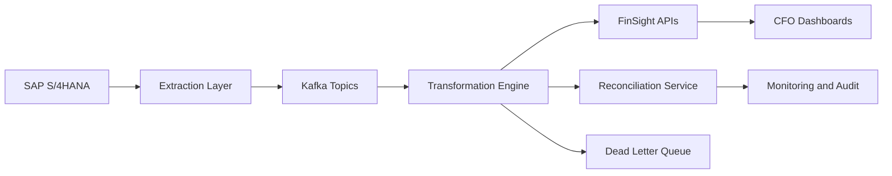

# FDE-9B Custom API Integration: SAP S/4HANA to FinSight

## Project Overview

This repository contains a production-oriented integration design for connecting Meridian Manufacturing's SAP S/4HANA ERP with the FinSight financial analytics platform. The solution uses SAP ODP/CDS extraction, Kafka-based decoupling, transformation services, idempotent FinSight loading, automated reconciliation, and full observability.

The design is written for an FDE-style deployment where business outcomes, system reliability, stakeholder communication, and implementation practicality are evaluated together.

## Business Problem

Meridian's finance team depends on delayed exports from SAP, creating limited visibility into GL, AP, AR, procurement, inventory, and budget performance. The proposed integration reduces finance data freshness from roughly 24 hours to a 4-hour SLA for standard domains and near-real-time deltas for priority postings.

## Solution Summary

SAP S/4HANA exposes finance and operational data through CDS views, ODP delta subscriptions, RFC/BAPI calls, and IDoc feeds. The integration layer extracts changes, publishes normalized events to Kafka, transforms and validates records, loads FinSight through secured REST APIs, and runs reconciliation controls after every batch.



## Repository Structure

| Path | Purpose |
| --- | --- |
| `docs/` | Requirements, architecture, API, error handling, reconciliation, stakeholder handoff |
| `api/` | OpenAPI 3.0 source and destination API specifications |
| `mappings/` | 80+ field-level mapping specification across SAP domains |
| `diagrams/` | Mermaid source diagrams for C4, sequence, data flow, and network views |
| `monitoring/` | Grafana-style dashboard and alert specification |
| `tests/` | Mandatory functional, non-functional, failure, security, and reconciliation test plan |
| `postman/` | Example Postman collection skeleton |
| `src/` | Runnable integration prototype for extraction, transformation, loading, DLQ, and reconciliation |
| `data/sample/` | Sample SAP GL records used by the prototype |
| `outputs/` | Generated prototype outputs after running the pipeline |

## Deliverable Index

| Deliverable | File |
| --- | --- |
| README and project overview | `README.md` |
| Changelog | `CHANGELOG.md` |
| Initial requirements | `docs/D0_Requirements_v1.md` |
| D1 Integration architecture | `docs/D1_Integration_Architecture_v1.md`, `diagrams/*.mmd` |
| D2 API specification | `docs/D2_API_Specification_v1.md`, `api/API_SAP_Source.yaml`, `api/API_FinSight_Destination.yaml` |
| D3 Data mapping | `mappings/MAP_Finance_AllDomains_v1.md` |
| D4 Error handling | `docs/D4_Error_Handling_Framework_v1.md` |
| D5 Reconciliation | `docs/D5_Reconciliation_Specification_v1.md` |
| D6 Monitoring | `monitoring/D6_Monitoring_Dashboard_v1.md` |
| D7 Test plan | `tests/D7_Integration_Test_Plan_v1.md` |
| Stakeholder communication | `docs/D8_Stakeholder_Communication_v1.md` |
| D9 Runnable prototype | `docs/D9_Runnable_Prototype_v1.md`, `src/sap_finsight_integration/` |

## Runnable Prototype

This submission includes a working Python prototype that simulates the SAP-to-FinSight GL pipeline. It reads sample SAP records, validates master data references, transforms valid records into FinSight canonical JSON, routes invalid records to DLQ, and produces a reconciliation report.

Run from the repository root:

```powershell
$env:PYTHONPATH = "src"
python -m sap_finsight_integration.cli
```

Run tests:

```powershell
python -m pytest
```

No-dependency test option:

```powershell
$env:PYTHONPATH = "src"
python -m unittest discover -s tests -p "*unittest.py"
```

Expected generated files:

- `outputs/finsight_gl_batch.json`
- `outputs/dlq_records.json`
- `outputs/reconciliation_report.json`
- `outputs/load_result.json`

## Target Architecture Principles

- Preserve financial correctness before optimizing throughput.
- Use ODP delta tokens for retry-safe extraction and no-loss recovery.
- Keep SAP production impact low through controlled package sizes, read windows, and RFC pool limits.
- Use Kafka for decoupling, replay, buffering, and surge absorption.
- Make all FinSight writes idempotent using deterministic business keys.
- Route bad records to domain-specific DLQs without blocking clean records.
- Keep all financial data processing in the India region to satisfy data residency expectations.

## Key SLAs

| Metric | Target |
| --- | --- |
| Standard data freshness | Under 4 hours |
| Priority GL delta freshness | Under 30 minutes |
| Batch reconciliation completion | Under 15 minutes after load |
| Record accuracy after transformation | Greater than 99.9% |
| Mandatory field completeness | Greater than 99.5% |
| Pipeline availability | 99.5% monthly |
| Duplicate target records | 0 tolerated |

## Assumptions

- SAP sandbox access may not be available; specifications are based on SAP S/4HANA integration patterns and the assessment appendix.
- FinSight is treated as a REST/OAuth 2.0 analytics platform with batch ingestion endpoints.
- Production deployment runs in an India-hosted cloud region.
- Master data dependencies such as cost centres, profit centres, vendors, customers, materials, and exchange rates are synchronized before dependent transactional loads.

## Validation Checklist

- OpenAPI files are written in OpenAPI 3.0.3 format.
- Mapping file contains more than the 50-field minimum.
- Tests include the 25 mandatory scenarios from the assessment.
- Error registry includes extraction, mapping, load, reconciliation, and infrastructure errors.
- Monitoring covers pipeline health, throughput, latency, errors, DLQ, reconciliation, SAP, FinSight, freshness, resources, Kafka lag, and circuit breakers.
- Runnable prototype demonstrates transformation, idempotency key generation, DLQ routing, and reconciliation.

## Personalization Needed Before Final Submission

- Replace repository name with `FDE-9B-{YourName}-{BatchID}`.
- Add your real name, batch ID, and GitHub link.
- Export Mermaid diagrams to PNG/SVG if the portal requires image uploads.
- Add actual lint output if Spectral or Swagger Editor is available.
- Add commit history progressively if the evaluation checks commit cadence.

## References Used

- SAP S/4HANA concepts: ACDOCA, CDS views, ODP, RFC, BAPI, IDoc, SAP Gateway/OData.
- OpenAPI 3.0 conventions for REST specification.
- Enterprise Integration Patterns: message broker, dead letter channel, idempotent receiver, circuit breaker, wire tap.
- Google SRE concepts: SLIs, SLOs, alerting, and error budgets.
